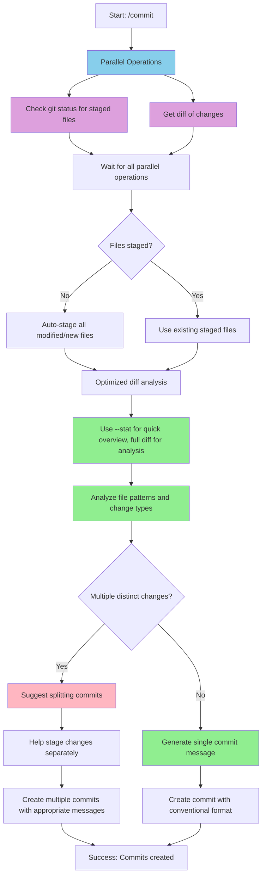
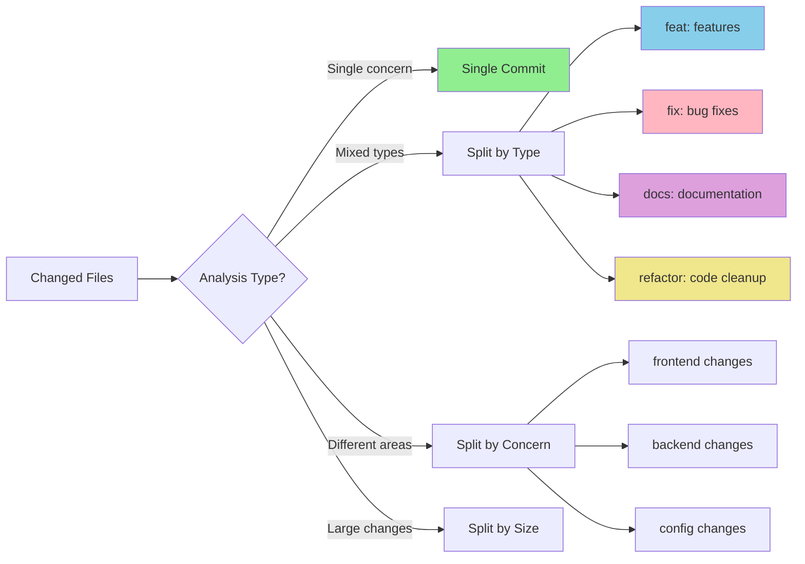

# Claude Command: Commit

This command helps you create well-formatted commits with conventional commit messages.

## Usage

To create a commit, just type:
```
/commit
```

Or with options:
```
/commit --no-verify
```

## Important Notes

- If specific files are already staged, the command will only commit those files
- If no files are staged, it will automatically stage all modified and new files
- The commit message will be constructed based on the changes detected
- Before committing, the command will review the diff to identify if multiple commits would be more appropriate
- If suggesting multiple commits, it will help you stage and commit the changes separately
- Always reviews the commit diff to ensure the message matches the changes

## Performance Improvements

The following optimizations significantly improve command execution speed:

- **Parallel git operations** - Run `git status` and `git diff` concurrently
- **Optimize diff analysis** - Use `git diff --stat` for quick overview, full diff for detailed analysis
- **Smart staging detection** - Cache staged file status to avoid repeated checks
- **Streamlined commit creation** - Direct commit message generation without temp files

## What This Command Does



## Commit Analysis Logic



## Conventional Commit Types

- **feat**: A new feature
- **fix**: A bug fix
- **docs**: Documentation changes
- **style**: Code style changes (formatting, etc)
- **refactor**: Code changes that neither fix bugs nor add features
- **perf**: Performance improvements
- **test**: Adding or fixing tests
- **chore**: Changes to the build process, tools, etc.
- **BREAKING CHANGE**: Changes that might cause the software to behave differently
- **build**: Changes related to building the software or its dependencies
- **ci**: Changes to scripts or configurations used during automated building, testing, or deployment
- **revert**: Undoing a previous commit

## Guidelines for Splitting Commits

When analyzing the diff, consider splitting commits based on these criteria:

1. **Different concerns**: Changes to unrelated parts of the codebase
2. **Different types of changes**: Mixing features, fixes, refactoring, etc.
3. **File patterns**: Changes to different types of files (e.g., source code vs documentation)
4. **Logical grouping**: Changes that would be easier to understand or review separately
5. **Size**: Very large changes that would be clearer if broken down

## Best Practices for Commits

- **Atomic commits**: Each commit should contain related changes that serve a single purpose
- **Split large changes**: If changes touch multiple concerns, split them into separate commits
- **Present tense, imperative mood**: Write commit messages as commands (e.g., "add feature" not "added feature")
- **Concise first line**: Keep the first line under 72 characters
- **Conventional commit format**: Use the format `<type>: <description>`

## Examples

Good commit messages:
- feat: add user authentication system
- fix: resolve memory leak in rendering process
- docs: update API documentation with new endpoints
- refactor: simplify error handling logic in parser
- fix: resolve linter warnings in component files
- chore: improve developer tooling setup process
- feat: implement business logic for transaction validation
- style: address minor styling inconsistency in header
- fix: patch critical security vulnerability in auth flow
- style: reorganize component structure for better readability
- refactor: remove deprecated legacy code
- feat: add input validation for user registration form
- ci: resolve failing CI pipeline tests
- feat: implement analytics tracking for user engagement
- fix: strengthen authentication password requirements
- feat: improve form accessibility for screen readers

Example of splitting commits:
- First commit: feat: add new solc version type definitions
- Second commit: docs: update documentation for new solc versions
- Third commit: chore: update package.json dependencies
- Fourth commit: feat: add type definitions for new API endpoints
- Fifth commit: feat: improve concurrency handling in worker threads
- Sixth commit: fix: resolve linting issues in new code
- Seventh commit: test: add unit tests for new solc version features
- Eighth commit: fix: update dependencies with security vulnerabilities