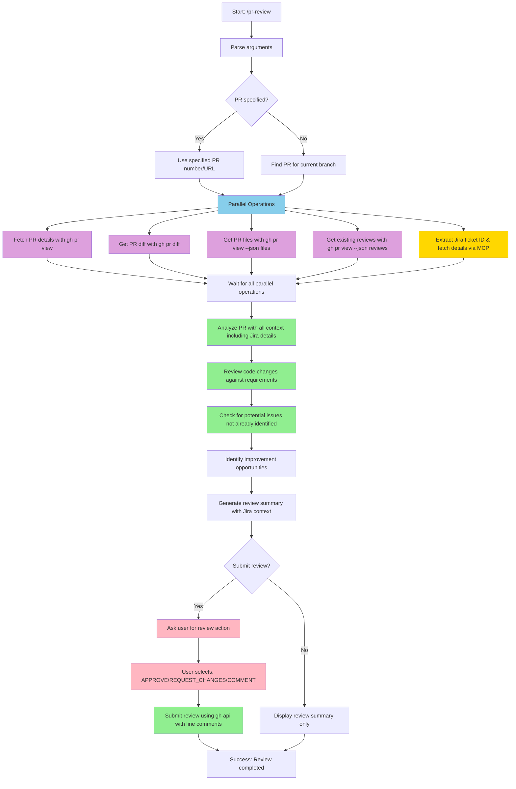
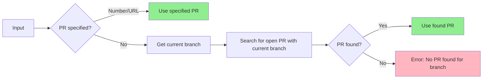
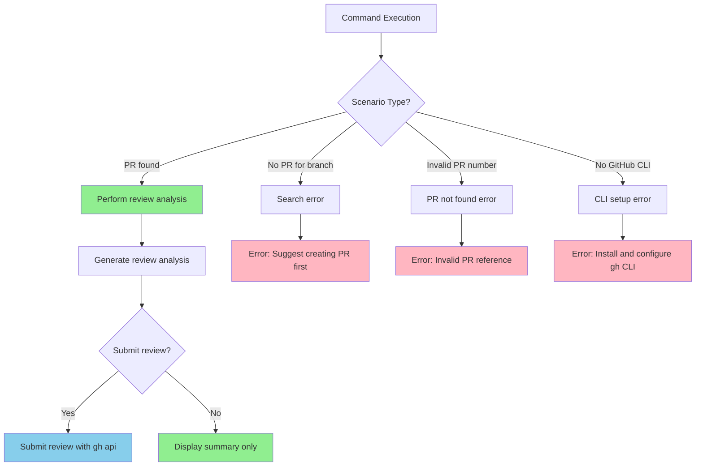

# Claude Command: PR Review

This command helps you review pull requests using the GitHub CLI API with intelligent analysis and precise line-level commenting.

## Usage

To review a pull request, just type:
```
/pr-review
```

Or with specific PR number:
```
/pr-review 123
/pr-review --pr 456
```

Or review a specific PR URL:
```
/pr-review https://github.com/owner/repo/pull/123
```

## Important Notes

- **Prerequisites**: Must be in a git repository with GitHub CLI configured
- If no PR number is specified, the command will look for an open PR for the current branch
- The command provides comprehensive analysis including code changes, potential issues, and suggestions
- **Smart reviewing**: Uses `gh api` to submit comprehensive reviews with precise line-level comments
- **Handles different PR states**: Works with draft PRs, ready PRs, and already reviewed PRs

## Performance Improvements

The following optimizations significantly improve command execution speed:

- **Parallel operations** - Run `gh pr view`, `gh pr diff`, existing reviews, and file analysis concurrently
- **Efficient diff parsing** - Analyze changes by file type and focus areas
- **Stream reviews** - Submit review comments efficiently using `gh api` with JSON payload
- **Cache PR data** - Avoid redundant API calls during analysis

## What This Command Does



## PR Detection Logic



The command automatically finds the relevant PR:

- **Explicit PR**: Use specified PR number or URL
- **Current branch**: Find open PR for the current branch
- **Error handling**: Clear message if no PR is found

## Jira Integration

The command automatically detects and fetches Jira ticket information to provide context-aware reviews:

### Ticket Detection
- **PR Title**: Searches for Jira ticket IDs (e.g., PROJ-123) in the PR title
- **Branch Name**: Extracts ticket IDs from branch names (e.g., feature/PROJ-123-add-feature)
- **PR Description**: Parses ticket references from the PR body

### Jira MCP Integration
When a Jira ticket is detected, the command:
1. Uses the Jira MCP server to fetch ticket details
2. Retrieves acceptance criteria, description, and requirements
3. Incorporates ticket context into the review analysis
4. Validates that implementation meets ticket requirements
5. Checks if all acceptance criteria are addressed

### Context-Aware Review
With Jira ticket information, the review includes:
- **Requirements Validation**: Ensures code changes align with ticket requirements
- **Acceptance Criteria Check**: Verifies all criteria are met
- **Scope Analysis**: Identifies if changes exceed or miss ticket scope
- **Related Issues**: Considers linked tickets and dependencies

## Review Analysis Areas

The command performs comprehensive analysis in these areas:

### 1. Code Quality Review
- **Style consistency**: Checks for consistent formatting and naming conventions
- **Best practices**: Identifies deviations from language/framework best practices  
- **Code complexity**: Flags overly complex functions or classes
- **Documentation**: Ensures adequate comments and documentation

### 2. Security Analysis
- **Vulnerability patterns**: Scans for common security issues
- **Input validation**: Checks for proper input sanitization
- **Authentication/Authorization**: Reviews access control implementations
- **Secrets exposure**: Identifies hardcoded secrets or sensitive data

### 3. Performance Review
- **Efficiency concerns**: Identifies potential performance bottlenecks
- **Resource usage**: Reviews memory and CPU intensive operations
- **Database queries**: Analyzes query efficiency and N+1 problems
- **Caching opportunities**: Suggests where caching could improve performance

### 4. Architecture & Design
- **Design patterns**: Ensures appropriate pattern usage
- **Separation of concerns**: Reviews code organization and modularity
- **Dependency management**: Checks for proper dependency injection
- **API design**: Reviews endpoint structure and RESTful principles

## Review Structure

When submitting a review with `gh api`, the command uses this structure:

```markdown
## 🔍 Code Review Summary

### 🎫 Jira Context (if available)
- **Ticket**: [PROJ-123: Ticket Title]
- **Requirements Met**: [✅/⚠️ Status of requirements]
- **Acceptance Criteria**: [Status of each criterion]

### ✅ Strengths
- [Positive aspects of the PR]

### ⚠️ Areas for Improvement
- [Issues found with suggestions]

### 🚀 Suggestions
- [Enhancement recommendations]

### 🛡️ Security Considerations
- [Security-related feedback if applicable]

---
*Generated with [Claude Code](https://claude.ai/code)*
```

## GitHub API Implementation

The command uses the GitHub CLI API to submit reviews with precise line-level comments:

```bash
gh api \
  --method POST \
  -H "Accept: application/vnd.github+json" \
  -H "X-GitHub-Api-Version: 2022-11-28" \
  /repos/OWNER/REPO/pulls/PULL_NUMBER/reviews \
  --input - <<< '{
  "commit_id": "latest_commit_sha",
  "body": "Comprehensive review summary with overall feedback",
  "event": "REQUEST_CHANGES",
  "comments": [
    {
      "path": "src/file.js",
      "position": 15,
      "body": "Consider using const instead of let for this variable since it''s never reassigned."
    },
    {
      "path": "src/file.js", 
      "position": 23,
      "body": "This function could benefit from error handling for edge cases."
    }
  ]
}'
```

### API Parameters

- **commit_id**: The SHA of the commit to review (uses latest commit from PR)
- **body**: Overall review summary and feedback
- **event**: Review action - `APPROVE`, `REQUEST_CHANGES`, or `COMMENT`
- **comments**: Array of line-specific comments with:
  - **path**: File path relative to repository root
  - **position**: Line position in the diff (not file line number)
  - **body**: Comment text with specific feedback

### Position Calculation

The `position` field represents the line's position in the unified diff, not the line number in the file:
- Position 1 = first line of the diff
- Only counts lines that appear in the diff (changed lines + context)
- The command calculates positions by parsing `gh pr diff` output

### User Interaction Flow

After analyzing the PR, the command explains what it plans to do and asks for confirmation:

```
Review Analysis Complete
   Found 3 issues requiring attention and 2 suggestions for improvement across 5 files.
   
   [DETAILED_FINDINGS_LIST]
   
   Based on the issues found, I recommend requesting changes before this can be merged.
   
   I'll submit a review with:
   - Overall feedback about the code quality and concerns
   - 5 specific line comments pointing out the issues and suggestions
   - Review action: REQUEST_CHANGES
   
   Proceed with submitting this review? (y/n)
```

This gives the user a clear understanding of what will happen and simple approval control.

## Common Scenarios and Error Handling



### Scenario 1: Successful PR Review
- Command finds PR and analyzes all changes
- Generates comprehensive review with actionable feedback
- Optionally submits formal review using `gh api` with line-specific comments

### Scenario 2: No PR Found for Branch
- **Issue**: Current branch has no associated open PR
- **Solution**: Command suggests creating a PR first or specifying a PR number

### Scenario 3: Invalid PR Reference
- **Issue**: Specified PR number doesn't exist or isn't accessible
- **Solution**: Command provides clear error message with suggestions

### Scenario 4: GitHub CLI Not Configured
- **Issue**: `gh` command not installed or not authenticated
- **Solution**: Command provides setup instructions

## Review Quality Guidelines

- **Constructive feedback**: Focus on improvements rather than just identifying problems
- **Specific suggestions**: Provide concrete examples and alternative approaches
- **Context awareness**: Consider the PR's purpose and scope when reviewing
- **Security focus**: Always check for security implications
- **Performance mindset**: Look for optimization opportunities
- **Maintainability**: Ensure code will be easy to maintain long-term

## Examples

Good review comments:
- "Consider extracting this complex logic into a separate utility function for better testability"
- "This database query could benefit from an index on the `user_id` column to improve performance"
- "The input validation here should include sanitization to prevent XSS attacks"
- "Great use of the strategy pattern here - makes the code very extensible"

Review focus areas by file type:
- **JavaScript/TypeScript**: Type safety, async handling, React patterns
- **Python**: PEP 8 compliance, error handling, performance patterns
- **Go**: Error handling, goroutine safety, interface usage
- **SQL**: Query optimization, injection prevention, indexing
- **CSS**: Responsive design, accessibility, performance

## Implementation Details

- Uses `gh pr view --json` to get structured PR data including files, commits, metadata, and existing reviews
- **Jira MCP Integration**: Automatically detects Jira ticket IDs and fetches ticket details via MCP server
- Analyzes `gh pr diff` output to understand specific code changes
- Performs static analysis on changed files based on file extensions
- **Context-aware analysis**: Incorporates Jira ticket requirements into code review
- Generates contextual comments based on the type of changes and project patterns
- **Avoids duplication**: Reviews existing comments and reviews to avoid repeating already identified issues
- **Submit reviews**: Uses `gh api` with GitHub's Reviews API to submit reviews with precise line comments
- **Interactive review submission**: Prompts user to choose between `APPROVE`, `REQUEST_CHANGES`, or `COMMENT` before submitting
- **Line-specific comments**: Places comments at exact file positions using the `position` field
- **Requirements validation**: Checks if implementation meets Jira ticket acceptance criteria
- Provides both summary view and detailed line-by-line analysis
- Supports reviewing PRs from forks and cross-repository contributions