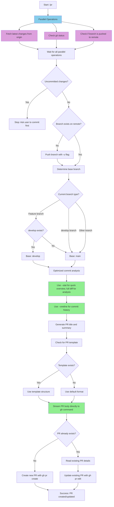
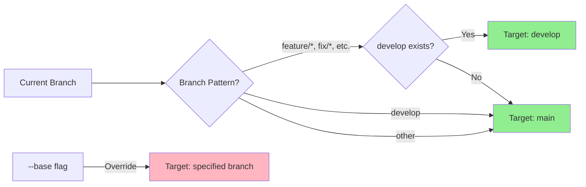
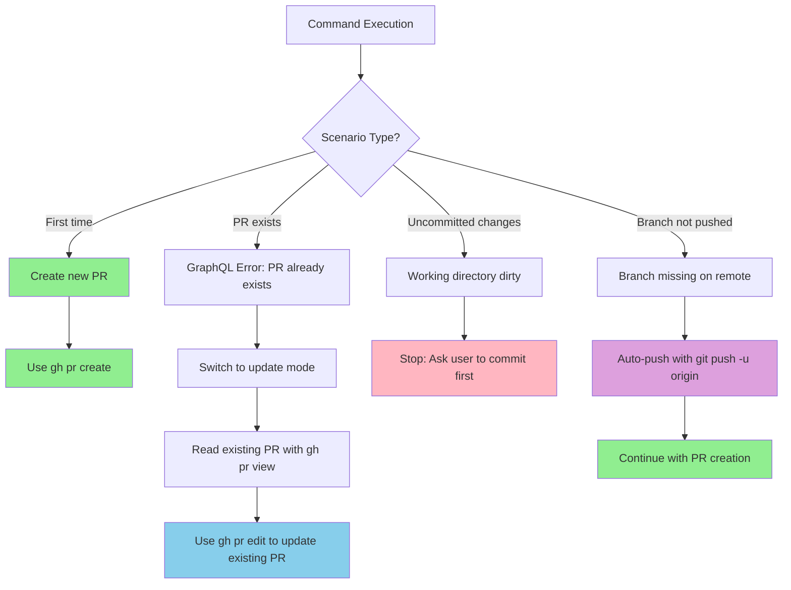

# Claude Command: Create PR

This command helps you create well-formatted pull requests using the GitHub CLI.

## Usage

To create a pull request, just type:
```
/pr
```

Or with options:
```
/pr --draft
/pr --base develop
```

## Important Notes

- **Prerequisites**: All changes must be committed and pushed before creating a PR
- If there are uncommitted changes, the command will stop and ask you to commit them first
- If the branch isn't pushed to remote, it will push with the `-u` flag
- The command analyzes ALL commits in the current branch since it diverged from the base branch
- Smart base branch detection follows common Git Flow patterns
- **Handles existing PRs gracefully**: If a PR already exists for the branch, the command first reads the existing PR details, then updates it instead of failing

## Performance Improvements

The following optimizations significantly improve command execution speed:

- **Parallel git operations** - Run `git status`, `git diff`, and branch checks concurrently
- **Optimize diff analysis** - Use `git diff --stat` for quick overview, full diff for detailed analysis
- **Stream PR body** - Pass content directly to `gh` commands instead of temp files
- **Reduce git log verbosity** - Use `--oneline` or `--format` for commit analysis

## What This Command Does



## Base Branch Detection Logic



The command automatically determines the target base branch:

- **Feature branches** (e.g., `feature/auth`, `fix/bug-123`): Target `develop` if it exists, otherwise `main`
- **develop branch**: Target `main`
- **Other branches**: Target `main` unless `--base` is specified
- **Override**: Use `--base <branch>` to specify a different target

## Pull Request Structure

The command creates PRs using this priority:

1. **If `.github/pull_request_template.md` exists**: Uses the template structure and fills in relevant sections
2. **If no template exists**: Uses the default format below:

**Title**: Brief description of the main change
**Body**:
```
## Description
Describe the changes made and why they were made.

## Related Issue(s)
Link or list the issue(s) this PR addresses (e.g., Closes #123).

## Type of change
- [ ] Bug fix
- [ ] New feature
- [ ] Breaking change
- [ ] Documentation update

## How has this been tested?
Describe the testing performed to ensure the changes are working as expected.

## Checklist for Reviewers
- [ ] Code follows project style guidelines.
- [ ] Tests cover the new functionality or bug fixes.
- [ ] Documentation is updated if necessary.
- [ ] Changes do not introduce new security vulnerabilities.

Generated with [Claude Code](https://claude.ai/code)
```

## Common Scenarios and Error Handling



### Scenario 1: First Time Creating PR
- Command creates a new PR using `gh pr create`
- Generates title and body based on commit analysis

### Scenario 2: PR Already Exists
- **Issue**: `GraphQL: A pull request already exists for <branch>. (createPullRequest)`
- **Solution**: Command automatically detects existing PR and switches to update mode
- First reads the existing PR details using `gh pr view` to understand current state
- Uses `gh pr edit --body-file <temp-file> --title "<updated-title>"` to update the existing PR
- Updates both title and description to reflect latest changes

### Scenario 3: Uncommitted Changes
- **Issue**: Working directory has uncommitted changes
- **Solution**: Command stops and prompts user to commit changes first

### Scenario 4: Branch Not Pushed
- **Issue**: Current branch doesn't exist on remote
- **Solution**: Command pushes branch with `git push -u origin <branch>`

## Best Practices for Pull Requests

- **Clear title**: Use descriptive titles that summarize the main change
- **Comprehensive summary**: Include 1-3 bullet points explaining what was changed
- **Test plan**: Provide clear steps for reviewers to test the changes
- **Atomic PRs**: Keep PRs focused on a single feature or fix when possible
- **Smart base branch detection**: The command automatically detects the appropriate target branch

## Examples

Good PR titles:
- feat: add user authentication system
- fix: resolve memory leak in rendering process
- docs: update API documentation with new endpoints
- refactor: simplify error handling logic in parser
- chore: update dependencies to latest versions

Good PR summaries:
- Add OAuth integration with Google and GitHub providers
- Fix race condition causing intermittent test failures
- Refactor database connection pooling for better performance
- Update React components to use new design system tokens

## Implementation Details

- Fetches origin to ensure up-to-date comparison with base branch
- Checks for existing PR template at `.github/pull_request_template.md`
- Uses `git diff <base-branch>...` to analyze all changes in the current branch compared to the target base branch
- If PR template exists, uses it as the structure and fills in the relevant sections
- If no template exists, generates PR body using the default structure below
- Writes the PR body content to a temporary file
- **New PR**: Uses `gh pr create --title "<generated-title>" --body-file <temp-file>` for proper formatting and special characters
- **Existing PR**: First reads the existing PR with `gh pr view`, then uses `gh pr edit --body-file <temp-file> --title "<updated-title>"` to update the PR with latest changes
- Cleans up temporary file after PR creation/update