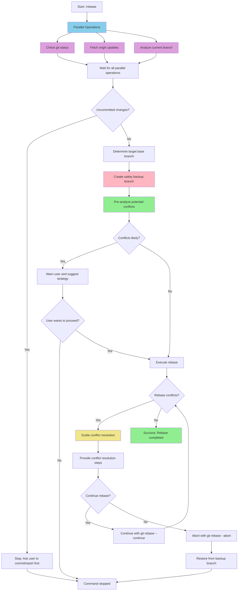
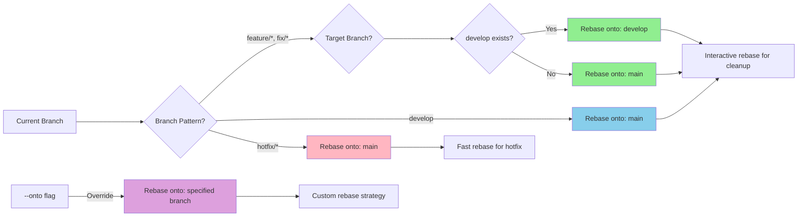
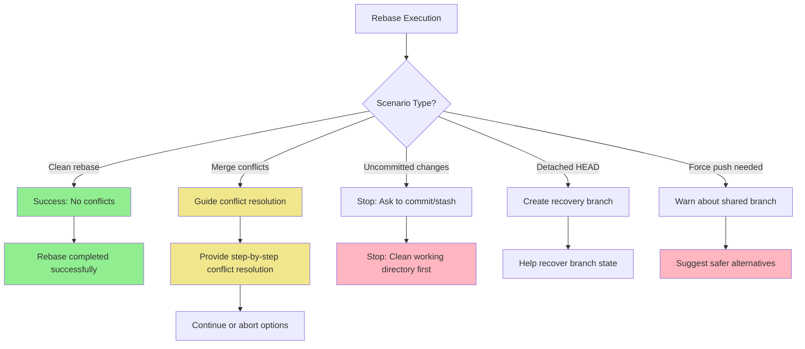

# Claude Command: Rebase

This command helps you perform interactive rebases with smart commit management and conflict resolution.

## Usage

To rebase the current branch, just type:
```
/rebase
```

Or with options:
```
/rebase --onto main
/rebase --interactive
/rebase --continue
/rebase --abort
```

## Important Notes

- **Prerequisites**: Ensure all changes are committed before rebasing
- If there are uncommitted changes, the command will stop and ask you to commit or stash them first
- Always fetches origin first to ensure base branch comparison is current
- The command analyzes commit history to suggest the most appropriate rebase strategy
- Smart conflict detection and resolution suggestions
- **Handles rebase conflicts gracefully**: Provides clear guidance for resolving conflicts step-by-step
- Creates backup branch before destructive operations for safety

## Performance Improvements

The following optimizations significantly improve command execution speed:

- **Parallel git operations** - Run `git status`, `git fetch`, and branch analysis concurrently
- **Smart conflict detection** - Pre-analyze potential conflicts before starting rebase
- **Optimized commit analysis** - Use `git log --stat` for quick overview, detailed analysis only when needed
- **Streamlined rebase workflow** - Direct command execution without temporary files

## What This Command Does



## Rebase Strategy Logic



## Rebase Types and When to Use

- **Interactive Rebase** (`git rebase -i`): Clean up commit history, squash commits, reorder changes
- **Standard Rebase** (`git rebase`): Move branch to latest base without history modification
- **Onto Rebase** (`git rebase --onto`): Move commits from one base to another specific point
- **Continue** (`git rebase --continue`): Resume rebase after resolving conflicts
- **Abort** (`git rebase --abort`): Cancel rebase and return to original state

## Conflict Resolution Strategies

When conflicts occur during rebase:

1. **Analyze conflict markers**: Understand `<<<<<<<`, `=======`, and `>>>>>>>` sections
2. **Identify conflict types**: Code conflicts, dependency conflicts, merge conflicts
3. **Resolution approaches**:
   - **Accept incoming**: Take changes from target branch
   - **Accept current**: Keep changes from current branch
   - **Manual merge**: Combine both sets of changes intelligently
4. **Validate resolution**: Ensure code still works after conflict resolution
5. **Continue rebase**: Use `git rebase --continue` after resolving all conflicts

## Common Scenarios and Error Handling



### Scenario 1: Clean Rebase
- No conflicts detected during rebase
- Branch history updated successfully
- Ready for push or further development

### Scenario 2: Merge Conflicts
- **Issue**: Conflicting changes between branches
- **Solution**: Guide user through conflict resolution process
- Identify conflict types and suggest resolution strategies
- Provide commands to continue or abort rebase

### Scenario 3: Uncommitted Changes
- **Issue**: Working directory has uncommitted changes
- **Solution**: Command stops and prompts user to commit or stash changes first

### Scenario 4: Shared Branch Warning
- **Issue**: Rebasing a branch that others might be using
- **Solution**: Warn about force push implications and suggest alternatives

## Best Practices for Rebasing

- **Never rebase shared branches**: Only rebase branches that haven't been pushed or shared
- **Create backup branches**: Always create safety backups before destructive operations
- **Rebase before merge**: Clean up commit history before creating pull requests
- **Interactive rebase for cleanup**: Use interactive mode to squash, reorder, or edit commits
- **Test after rebase**: Ensure functionality still works after history modification
- **Communicate with team**: Inform team members about rebased shared branches

## Examples

Good rebase scenarios:
- `feat/user-auth` rebased onto latest `develop`
- Interactive rebase to squash multiple small commits into logical units
- Moving feature branch from `main` to `develop` using `--onto`
- Cleaning up commit messages and removing debug commits

Example interactive rebase plan:
```
pick a1b2c3d feat: add user authentication
squash e4f5g6h fix: typo in auth function  
squash h7i8j9k fix: linting issues
pick k10l11m docs: update auth documentation
reword n12o13p test: add auth unit tests
```

## Safety Features

- **Automatic backup creation**: Creates `backup/<branch-name>` before rebasing
- **Conflict pre-analysis**: Warns about potential conflicts before starting
- **Step-by-step guidance**: Provides clear instructions during conflict resolution
- **Easy abort option**: Simple command to cancel and restore original state
- **Validation checks**: Ensures working directory is clean before starting
- **Force push warnings**: Alerts about implications of rewriting shared history